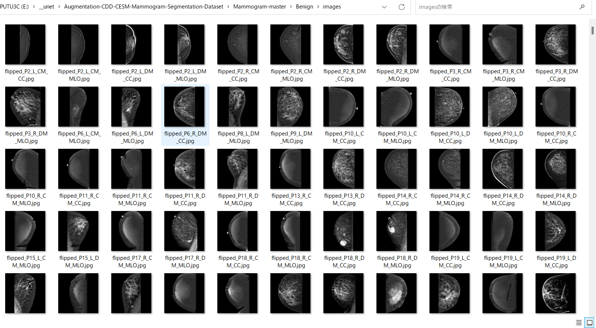

# Augmentation-CDD-CESM-Mammogram-Segmentation-Dataset

<h2>
1 Augmentation-CDD-CESM-Mammogram-Segmentation-Dataset
</h2>
This is a simple tool to augment 
<a href="https://wiki.cancerimagingarchive.net/pages/viewpage.action?pageId=109379611#109379611bcab02c187174a288dbcbf95d26179e8
">
Categorized Digital Database for Low energy and Subtracted Contrast Enhanced Spectral Mammography images (CDD-CESM)
</a>
 
Please clone this repository to your working folder. 

<h2>
2 Download master CDD-CESM-Mammogram dataset
</h2>
Please download CDD-CESM-Mammogram dataset from the following link.
The image dataset used here has been taken from the following web site. 

Categorized Digital Database for Low energy and Subtracted Contrast Enhanced Spectral Mammography images (CDD-CESM)
https://wiki.cancerimagingarchive.net/pages/viewpage.action?pageId=109379611#109379611bcab02c187174a288dbcbf95d26179e8

Citations & Data Usage Policy
Users must abide by the TCIA Data Usage Policy and Restrictions. Attribution should include references to the following citations:

<pre>
Data Citation
Khaled R., Helal M., Alfarghaly O., Mokhtar O., Elkorany A., El Kassas H., Fahmy A. Categorized Digital Database 
for Low energy and Subtracted Contrast Enhanced Spectral Mammography images [Dataset]. (2021) The Cancer Imaging
 Archive. DOI:  10.7937/29kw-ae92 

Publication Citation
Khaled, R., Helal, M., Alfarghaly, O., Mokhtar, O., Elkorany, A., El Kassas, H., & Fahmy, A. Categorized contrast
 enhanced mammography dataset for diagnostic and artificial intelligence research. (2022) Scientific Data, 
 Volume 9, Issue 1. DOI: 10.1038/s41597-022-01238-0

TCIA Citation
Clark K, Vendt B, Smith K, Freymann J, Kirby J, Koppel P, Moore S, Phillips S, Maffitt D, Pringle M, Tarbox L,
 Prior F. The Cancer Imaging Archive (TCIA): Maintaining and Operating a Public Information Repository, 
 Journal of Digital Imaging, Volume 26, Number 6, December, 2013, pp 1045-1057. DOI: 10.1007/s10278-013-9622-7
</pre>

Please expand downloaded file and move those to the cloned 
<b>Augmentation-CDD-CESM-Mammogram-Segmentation-Dataset</b> folder 
<pre>
Augmentation-CDD-CESM-Mammogram-Segmentation-Dataset
├─Low energy images of CDD-CESM
└─Subtracted images of CDD-CESM
</pre>

<h2>
3 Generation of image and mask dataset
</h2>

Please run the following bat file to generate image and mask files of size 512x512 from the original image jpg files.

<pre>
>1.generator.bat
</pre>
, which simply runs following Python script <a href="./ImageMaskDatasetGenerator">ImageMaskDatasetGenerator</a>. 
<pre>
>python ImageMaskDatasetGenerator.py ./image_mask_generator.config
</pre>

,where image_mask_generator.config is the following. 
<pre>
; image_mask_generator.config
; CDD-CESM Mammogram 
; Copyright (C) antillia.com
; 2023/07/25

[generator]
images_dirs        = ["./Low energy images of CDD-CESM", "./Subtracted images of CDD-CESM"]
segmentation_file = "./Radiology_hand_drawn_segmentations_v2.csv"
annotation_file   = "./Radiology-manual-annotations.csv"
output_dir        = "./Mammogram-master"
resize            = 512

[maskcolor]
Benign    = (  0,  255,   0)
Malignant = (255,  255, 255)

</pre>

<b>Benign images samples</b> 
 
 
<b>Benign masks samples</b> 
 
 
 

<b>Malignant images samples</b> 
 
 
<b>Malignant masks samples</b> 
 

